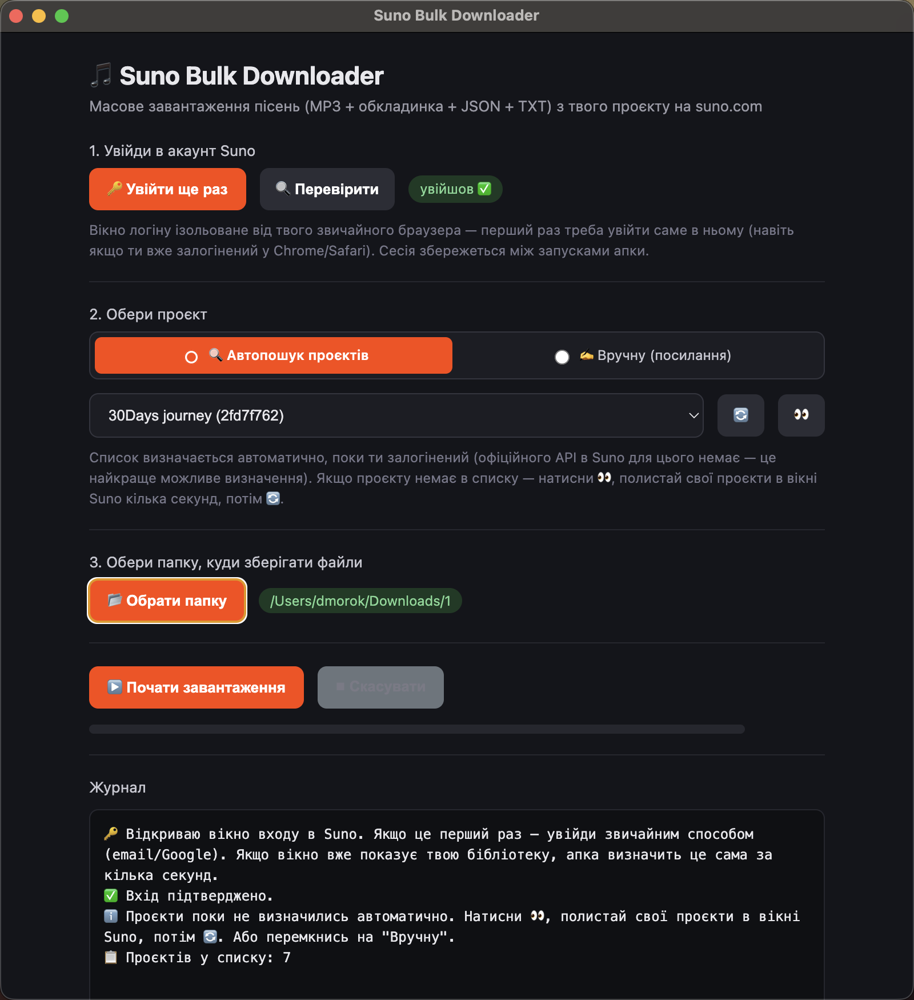

# Suno Bulk Downloader (десктоп-апка)



Апка масово завантажує пісні з твого проєкту/workspace на suno.com: для кожної пісні зберігає MP3, обкладинку (JPEG), JSON з усіма даними та TXT з назвою/промптом/тегами.

Як це працює зсередини: у програмі є приховане вікно логіну, куди ти один раз входиш у свій акаунт Suno (як у звичайному браузері). Далі програма сама, в фоні, раз у раз бере з цього вікна свіжий токен доступу і через нього опитує внутрішнє API Suno та стягує файли — тобі не треба нічого копіювати вручну.

**Вибір проєкту — два взаємовиключні режими (перемикач угорі кроку 2):**

- **🔍 Автопошук проєктів.** Одразу після входу апка робить один прямий запит до `studio-api-prod.suno.com/api/project/me`, який повертає повний список усіх твоїх проєктів (id + назва) — той самий виклик, який робить сам сайт Suno для сторінки "Workspaces". Список одразу з'являється у випадаючому меню.
- **✍️ Вручну (посилання).** Просто встав URL свого проєкту з адресного рядка (має містити `?wid=...`).

Активний лише один режим одночасно — перемикаєшся кнопками нагорі.

**Важливо про вхід:** вікно логіну в апці — окрема, ізольована сесія браузера, не пов'язана з твоїм звичайним Chrome/Safari. Навіть якщо ти вже залогінений у Suno в звичайному браузері, перший раз треба увійти саме у вбудованому вікні апки. Далі ця сесія зберігається між запусками, повторно логінитись не треба.

Якщо після входу кнопка довго висить на "Очікую вхід..." — закрий і відкрий вікно ще раз, або натисни **"🔍 Перевірити"** поруч із кнопкою входу.

## Встановлення (один раз)

1. Встанови **Node.js** (LTS-версія): https://nodejs.org
2. Розпакуй цю папку `suno-bulk-downloader` куди зручно.
3. Відкрий термінал у цій папці (Windows — "Command Prompt"/"PowerShell", macOS — "Terminal").
4. Виконай:
   ```
   npm install
   ```

## Запуск під час розробки/тесту

```
npm start
```

## Як користуватись

1. Натисни **"Увійти в Suno"** — відкриється окреме вікно, увійди в акаунт як зазвичай (email/Google). Апка сама підтвердить вхід і одразу підтягне список проєктів.
2. Обери режим:
   - **Автопошук** — вибери проєкт у списку. Якщо порожньо, натисни 🔄 (список оновлюється одним прямим запитом, без залежності від того, яка сторінка відкрита у вікні Suno).
   - **Вручну** — встав посилання на проєкт (`?wid=...`).
3. Натисни **"Обрати папку"**.
4. Натисни **"Почати завантаження"**. Прогрес і журнал — прямо у вікні. "Скасувати" зупиняє в будь-який момент.

Файли зберігаються у підпапці виду `SUNO_2026-07-25_НазваПроєкту`, по 4 файли на пісню (`.mp3`, `.jpeg`, `.json`, `.txt`).

## Збірка окремої програми

### Windows → portable .exe (виконати на Windows)
```
npm run build:win
```
Результат: `dist/Suno Bulk Downloader 2.0.0.exe` — portable, без інсталяції.

### macOS → .app (виконати на Mac)
```
npm run build:mac
```
Результат: `dist/mac/Suno Bulk Downloader.app`. Апка не підписана сертифікатом Apple — при першому запуску клікни правою кнопкою → "Відкрити" → підтверди.

## Примітки

- Пауза 1–4 сек між завантаженнями пісень (як в оригінальному скрипті).
- Токен оновлюється автоматично перед кожним запитом — довгі завантаження не "відвалюються".
- API-домен, який реально використовує сайт Suno — `studio-api-prod.suno.com` (дефіс, не крапка); саме його використовує апка як для списку проєктів, так і для завантаження пісень.
- Журнал подій у вікні апки показує, на якому кроці й чому саме сталась помилка.
